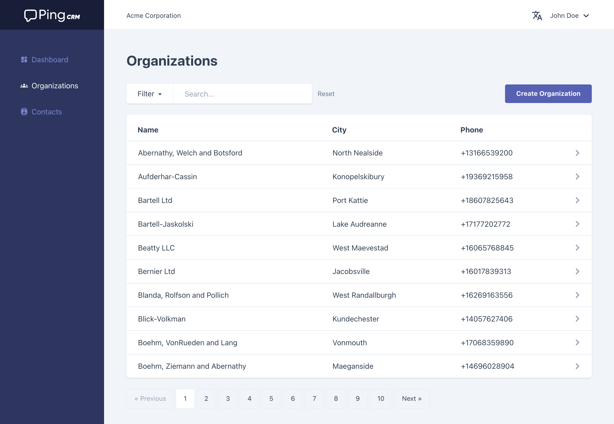

<p align="center">
  
</p>

<h1 align="center">Ping CRM</h1>

<p align="center">
<a href="https://github.com/aminevg/pingcrm-hybridly/actions/workflows/ci.yml"></a>
</p>

<div align="center">
  <br />
  An implementation of <a href="https://github.com/inertiajs/pingcrm/">Ping CRM</a>, with a few bells and whistles to showcase Hybridly features.
  <br />
  <br />
  <br />
</div>



<br />

# What's changed

The visual aspect of things is mostly unchanged from the original implementation, but there has been some changes under the hood:

- **Up-to-date**: This repository uses Vue 3, Laravel 9 and Tailwind CSS 3
- **Vite**: For super-fast HMR
- **Typescript**: Vue components are rewritten in Composition API + Typescript
- **Data objects**: `spatie/laravel-data` is used for TS type generation and added type safety
- **Localization**: Locale switching has been implemented to illustrate Hybridly's integration with vue-i18n. English and Japanese are currently supported, and we welcome PRs for other languages!

# Installation

## Via dev containers

Simply open Visual Studio Code (or any dev container-compatible editor) and open this project in a container! You can then setup as usual:

```
php artisan key:generate
php artisan migrate
php artisan db:seed
```

## Via Laravel Sail

```
composer install
vendor/bin/sail up -d
vendor/bin/sail artisan key:generate
vendor/bin/sail artisan migrate
vendor/bin/sail artisan db:seed
```
